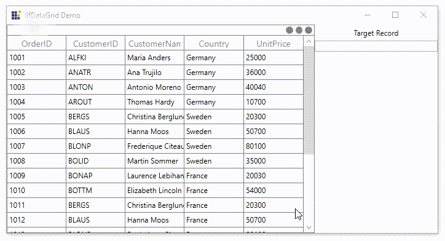

# How to Get the Target Record when Drop the Row in WPF DataGrid?

This example illustrates how to get the target record when drop the row in [WPF DataGrid](https://www.syncfusion.com/wpf-controls/datagrid) (SfDataGrid).

`DataGrid` does not provide the direct support to get the target record which is going to drop. You can get the target record which is going to drop by using [SfDataGrid.RowDragDropController.Drop](https://help.syncfusion.com/cr/wpf/Syncfusion.UI.Xaml.Grid.GridRowDragDropController.html#Syncfusion_UI_Xaml_Grid_GridRowDragDropController_Drop) event.

```C#
sfDataGrid.RowDragDropController.Drop += RowDragDropController_Drop;

private void RowDragDropController_Drop(object sender, GridRowDropEventArgs e)
{
    var droppedIndex = (int)e.TargetRecord;
    var rowIndex = this.sfDataGrid.ResolveToRowIndex(droppedIndex);
    NodeEntry recordEntry = null;

    if (this.sfDataGrid.View.TopLevelGroup != null)
        recordEntry = this.sfDataGrid.View.TopLevelGroup.DisplayElements[this.sfDataGrid.ResolveToRecordIndex(rowIndex)];            
    else
        recordEntry = this.sfDataGrid.View.Records[this.sfDataGrid.ResolveToRecordIndex(rowIndex)];

    var targetRecord = ((recordEntry as RecordEntry).Data as OrderInfo);
    
    txtDisplayRecord.Text = "OrderId : " + targetRecord.OrderID + "\nCustomerID : " + targetRecord.CustomerID + "\nCustomerName : " + targetRecord.CustomerName + "\nCountry : " + targetRecord.Country + "\nUnitPrice : " + targetRecord.UnitPrice + "\nRow Index :" + droppedIndex;
}
```

